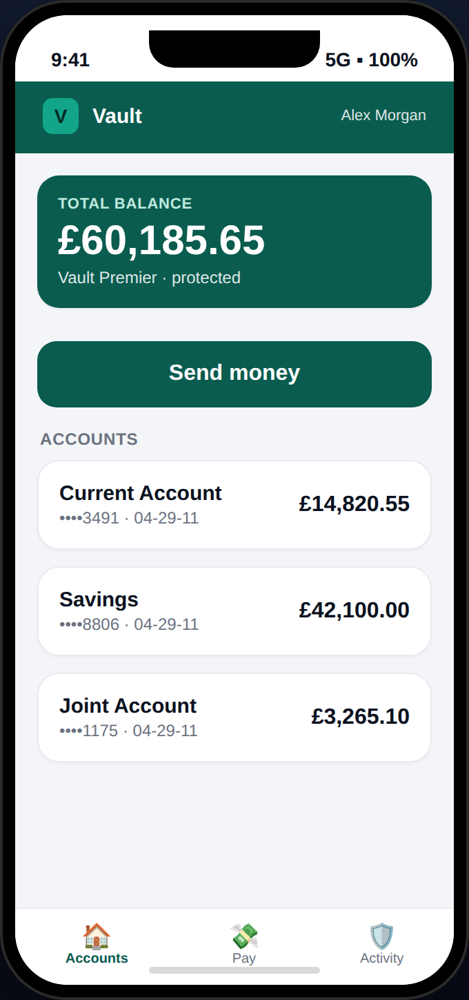
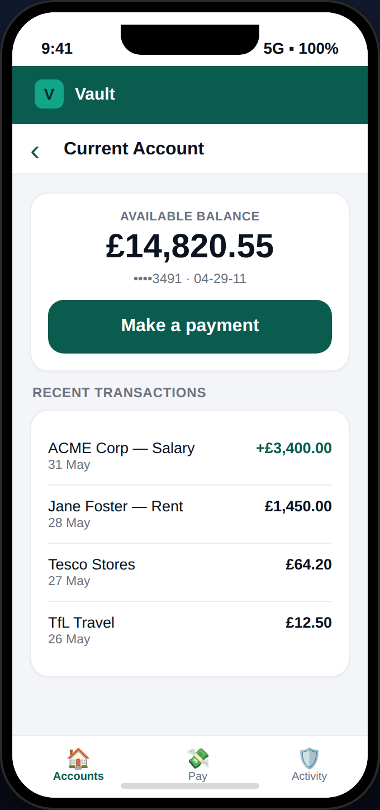
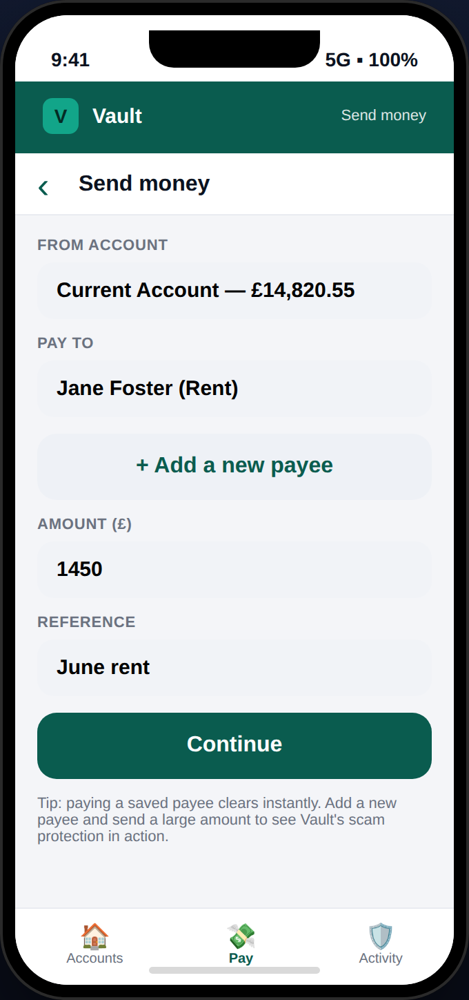
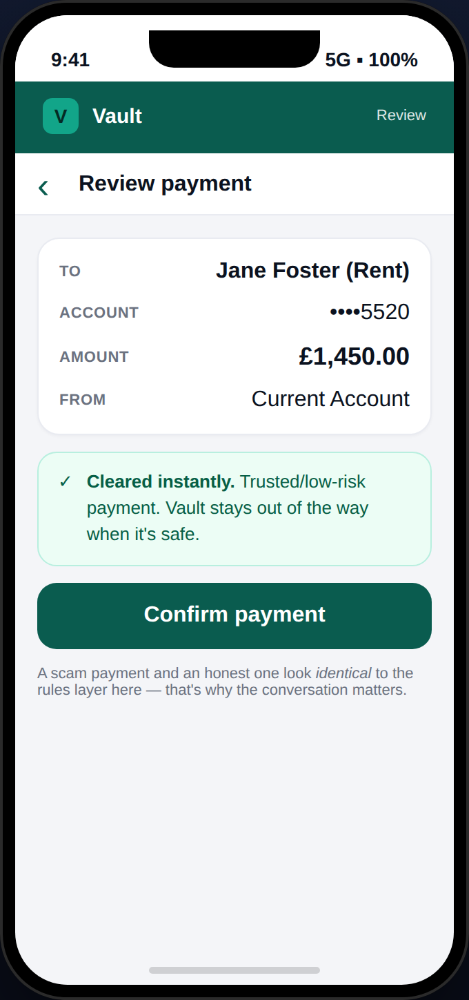
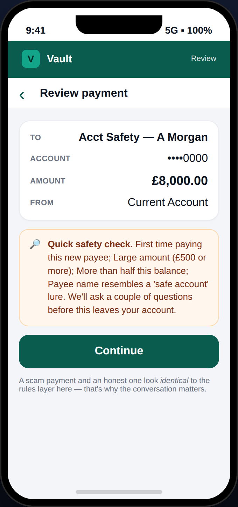
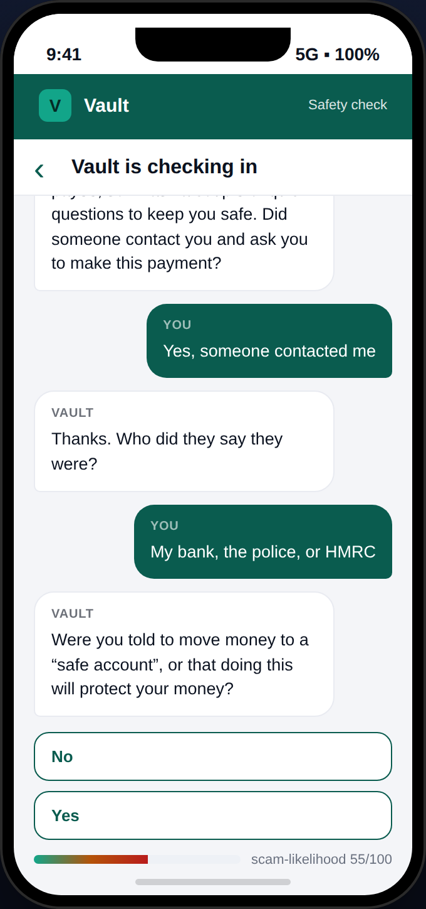
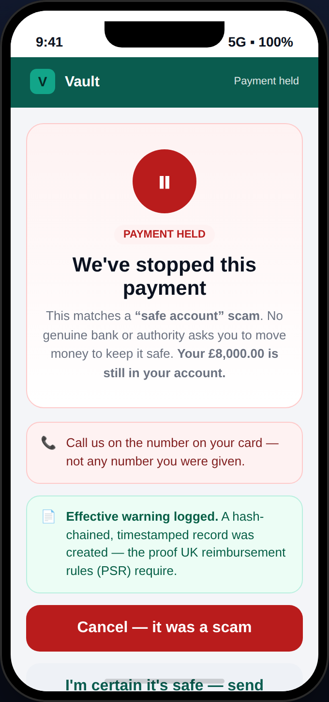
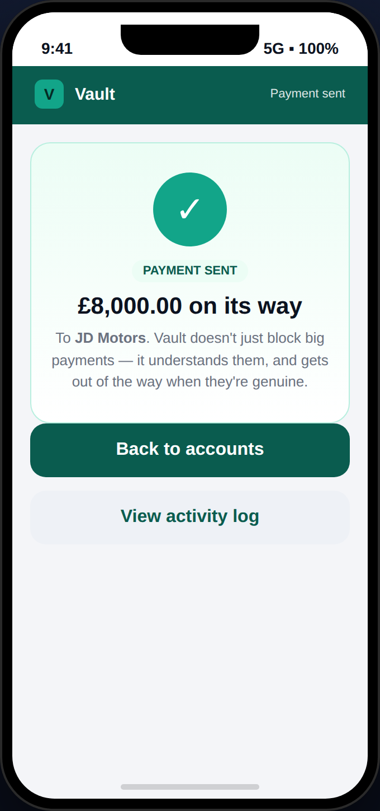
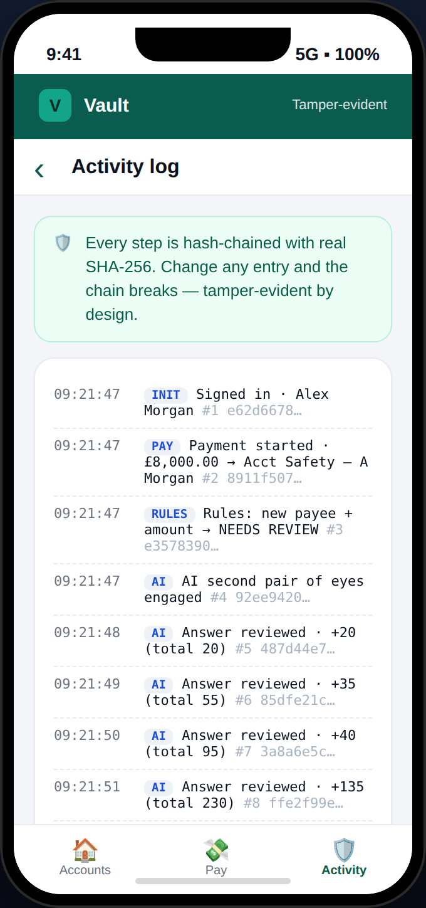

# Vault — App Flow & Demo Walkthrough

A visual walkthrough of the **Vault** banking app (`demo/standalone.html`). Every
screenshot below was captured from the actual running app — no mockups. The app
runs entirely in the browser (no server, no install).

> **Headline:** Two payments. Same amount. Same new payee. A rules engine sees one
> transaction twice. Vault sees a customer buying a car — and a customer being robbed.

---

## 1. Dashboard — your accounts

The home screen: total balance, a prominent **Send money** action, and the
customer's three accounts (Current, Savings, Joint) with masked numbers. Bottom
tab bar: Accounts · Pay · Activity.

## 2. Account detail — balance & transactions

Tap an account to see its balance and recent transactions, with a **Make a
payment** button. This is a normal, familiar banking experience.

## 3. Send money — the payment form

A real, working form: choose the account, pick a saved payee (or **+ Add a new
payee**), enter an amount and reference.

## 4. Paying a trusted payee — cleared instantly

Pay a saved, trusted payee (e.g. the landlord) and Vault stays out of the way:
**cleared instantly**, zero friction. Security that's invisible when it's safe.

## 5. Large payment to a NEW payee — safety check

Send a large amount (£8,000) to a brand-new payee and the cheap **rules layer**
flags it for a closer look. Crucially, a scam payment and an honest one look
*identical* at this stage — which is exactly why the conversation matters.

## 6. The conversation — a second pair of eyes

Vault opens a short, adaptive conversation grounded in real scam patterns. It
reads each answer in real time (note the **scam-likelihood meter** climbing) —
this scoring is genuine, not scripted.

## 7a. The scam — held (the save)

When the answers match a coercion fingerprint ("bank fraud team", "safe
account"), Vault **holds the payment** — it does *not* auto-decline. The money
never leaves the account, and an **effective warning** is logged (the proof UK
PSR reimbursement rules require).

## 7b. The honest purchase — sent

The *same £8,000 to a new payee*, but the answers describe a genuine car
purchase. No coercion pattern → Vault understands it's legitimate and **sends
it**. It doesn't just block big payments; it understands them.

## 8. Activity log — tamper-evident audit trail

Every step — the rules trigger, each answer, the verdict — is written to an
**immutable, hash-chained audit trail** using real SHA-256. Change any entry and
the chain breaks. The running scam score is visible per step (20 → 55 → 95 → 230).

---

## The two-stage engine (what's happening underneath)

1. **Rules layer (cheap, deterministic):** new payee? large amount? > half the
   balance? payee-name lure? → decides *whether* to intervene.
2. **AI conversation (reads the human):** scores structured answers *and* free
   text against real APP-scam typologies → decides *what to do*: **release** or
   **hold + escalate**.

## Governance principles (the hero of the demo)

- **Friction over autonomy** — Vault holds and explains; it never blocks
  outright. The customer keeps agency.
- **Fails closed** — if the analyst errors, the payment holds. We never fail open
  on money.
- **Explainable** — every decision shows its reasons and is logged.
- **Tamper-evident** — hash-chained audit = PSR "effective warning" evidence.

## Run it yourself

Open `demo/standalone.html` in any browser (double-click — no install). Try:
1. Pay **Jane Foster (Rent)** £1,450 → clears instantly.
2. **Send money** → **+ Add a new payee** → £8,000 → answer the chat.
   - "seller / my own idea" → **sent**.
   - "bank fraud team / safe account" → **held**.
3. Open the **Activity** tab → verify the hash chain.
